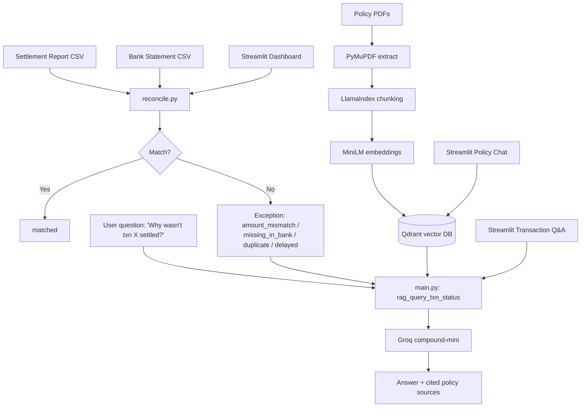

# Architecture

## Data flow summary

1. **Reconciliation path:** two CSVs → rule-based matcher → classified
   records with reasons → dashboard + exception list

2. **Knowledge path:** policy PDFs → chunked → embedded → stored in Qdrant
   for semantic search

3. **Answer path:** a question about a transaction pulls both the
   reconciliation reason and relevant policy text, then an LLM combines
   them into one grounded answer

4. **Orchestration:** every multi-step operation (ingest, query, txn lookup)
   runs as an Inngest function — retryable, observable, and step-isolated
